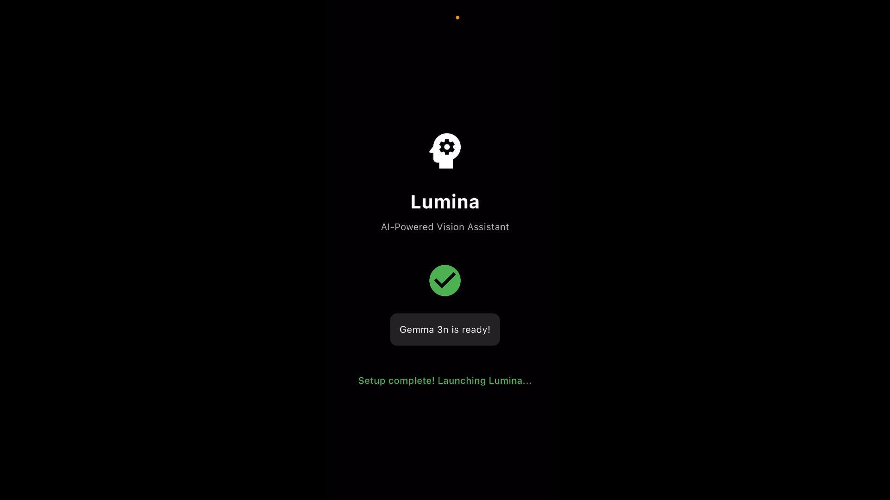

# Lumina - AI Assistant for the Visually Impaired



**"The world sees you."**

Lumina is an innovative Flutter mobile application designed to empower visually impaired individuals through advanced computer vision and AI technologies. The app provides real-time assistance for navigation, object recognition, and environmental understanding.

## Demo

[](https://youtu.be/G3-jX3C1phU)

The product release is coming soon, VoiceOver is fully supported - stay tuned!

## Features

- **Visual Question Answering (VQA)**: Ask questions about your surroundings and get detailed descriptions powered by AI
- **Real-time Object Detection**: Identify and locate objects in your environment using YOLO deep learning models
- **Depth Estimation**: Calculate distances to objects and surfaces for better spatial awareness
- **Obstacle Avoidance**: Receive intelligent hints and guidance to navigate safely around obstacles
- **Speech Integration**: Hands-free interaction with speech-to-text input and text-to-speech feedback
- **Smart Camera Interface**: Optimized camera controls for accessibility and ease of use

## Prerequisites

### Apple Developer Program Membership

To run this app on iOS devices, you must have an active **Apple Developer Program** membership ($99/year) to set up the necessary entitlements for extended memory usage on devices.

### System Requirements

- **Flutter SDK**: 3.8.1 or compatible
- **Dart SDK**: Compatible with Flutter version
- **iOS Development**:
  - Xcode 14.0 or later
  - iOS 12.0 or later (target device)
  - Valid Apple Developer account
  - Code signing certificate and provisioning profile
- **Android Development** (optional):
  - Android Studio or VS Code with Flutter extension
  - Android SDK (API level 21 or higher)

### Required Device Permissions

The app requires the following permissions to function properly:

- **Camera Access**: For real-time image capture and processing
- **Microphone Access**: For speech-to-text functionality
- **Storage Access**: For caching AI models and temporary data

## Installation & Setup

### 1. Clone the Repository

```bash
git clone https://github.com/axxshen/lumina-demo
cd lumina-demo
```

### 2. Navigate to App Directory

```bash
cd app
```

### 3. Install Dependencies

```bash
flutter pub get
```

### 4. iOS Setup (Required for iOS deployment)

1. **Open iOS project in Xcode**:
   ```bash
   open ios/Runner.xcworkspace
   ```

2. **Configure Code Signing**:
   - Select your development team in Xcode
   - Ensure you have a valid provisioning profile
   - Update the bundle identifier to match your Apple Developer account

3. **Update Entitlements**:
   The app requires specific entitlements in `ios/Runner/Runner.entitlements`:
   ```xml
   <?xml version="1.0" encoding="UTF-8"?>
   <!DOCTYPE plist PUBLIC "-//Apple//DTD PLIST 1.0//EN" "http://www.apple.com/DTDs/PropertyList-1.0.dtd">
   <plist version="1.0">
   <dict>
      <key>com.apple.developer.kernel.extended-virtual-addressing</key>
      <true/>
      <key>com.apple.developer.kernel.increased-memory-limit</key>
      <true/>
      <key>com.apple.developer.kernel.increased-debugging-memory-limit</key>
      <true/>
   </dict>
   </plist>
   ```

### 5. Run the Application

#### For iOS (Requires Apple Developer Program):
```bash
flutter run -d ios
```

#### For Android:
```bash
flutter run -d android
```

#### For Development/Testing:
```bash
flutter run
```

## Technical Architecture

### Core Technologies

- **Flutter Framework**: Cross-platform mobile development
- **YOLO (Ultralytics)**: Real-time object detection and recognition
- **Flutter Gemma**: On-device AI language model for VQA
- **Computer Vision**: Advanced image processing and depth estimation
- **Speech Technologies**: Integration of STT and TTS for accessibility

### Key Dependencies

- `ultralytics_yolo`: Object detection and computer vision
- `flutter_gemma`: On-device AI language model
- `camera`: Camera access and control
- `speech_to_text`: Voice input processing
- `flutter_tts`: Text-to-speech output
- `provider`: State management
- `permission_handler`: Device permission management

### AI Models

The app utilizes pre-trained deep learning models for:
- Object detection and classification
- Depth estimation algorithms
- Natural language processing for VQA
- Spatial reasoning for obstacle avoidance

## Project Structure

```
app/
├── lib/
│   ├── main.dart              # Application entry point
│   ├── features/              # Feature-specific modules
│   ├── models/                # Data models and AI model interfaces
│   ├── pages/                 # UI screens and pages
│   ├── services/              # Core services (camera, AI, speech)
│   ├── utils/                 # Utility functions and helpers
│   └── widgets/               # Reusable UI components
├── assets/                    # Audio files and app icons
├── ios/                       # iOS-specific configuration
├── android/                   # Android-specific configuration
└── pubspec.yaml              # Project dependencies
```

## Technical Documentation

For detailed implementation guides, including Gemma 3B integration, common challenges, and solutions, see:

📋 **[TECHNICAL_DOCS.md](TECHNICAL_DOCS.md)** 

### Support

Please contact the development team or open a new [issue](https://github.com/axxshen/lumina-demo/issues).

---

*Lumina - The world sees you*